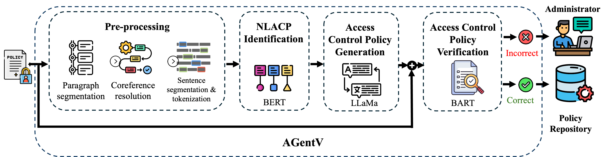

# AGentV: Access Control Policy Generation and Verification Framework with Language Models

<!-- Demo  <a target="_blank" href="https://colab.research.google.com/drive/1QlG_XXEvTwejCHDaUQSDMkoQWBKNn97d">
  
</a> -->

Code repository for the paper "AGentV: Access Control Policy Generation and Verification Framework with Language Models". AGentV is a framework developed to use language models and large language models to,
* Identify natural language policies (NLACPs) from high-level requirement specification documents of an organization (using [BERT LM](https://huggingface.co/docs/transformers/model_doc/bert#transformers.BertModel))
* Translate identified NLACPs into structured representations separating access control rules (ACRs) with five policy components: subjects, actions, resources, purposes, and conditions (using [LLaMa 3 8B](https://huggingface.co/meta-llama/Meta-Llama-3-8B))
* Automatically verify the generated structured representations and provide feedback to the administrators if the representation is incorrect, mentioning the reason/error (using [BART LM](https://huggingface.co/facebook/bart-large)) and the location of the error in the generated policy (using integrated gradients feature attribution via [Captum](https://captum.ai/docs/attribution_algorithms#integrated-gradients)).

By developing this framework, we improve the reliability of the automated policy generation process and, in turn, reduce the data breaches due to access control failures in the future.



#### Demo

The provided demo with HotCRP privacy policies can be run in the terminal using the following commands.

```bash
$ git clone https://github.com/accessframework/agentv.git
$ cd agentv/demo
$ ./demo.sh
```

## Setup
### Installation
Clone the repository
```bash
$ git clone https://github.com/accessframework/agentv.git
$ cd agentv/
```
(Recommended) Create a new Python virtual environment
```bash
$ python3 -m venv venv
$ source venv/bin/activate
```
Install the dependencies
```bash
$ pip install -r requirements.txt
```

> NOTE : All the parts of the framework were only tested on Ubuntu machine with NVIDIA A100-SXM4-80GB GPU and 1007G memory. 

### Checkpoints

Download the checkpoints necessary to reproduce the results
```bash
$ gdown --folder https://drive.google.com/drive/folders/1404ix73aV_aUbbjntXxIrqkjr8e9PyMw 
```

## Inference

The easiest way to reproduce the results reported in the paper is to run the trained models on the prepared datasets used in the paper. To this end, we will explain how to run the models for each step of the framework in the following sections.
### NLACP Identification

To reproduce the results for NLACP identification step, run the following commands with `<mode> = [collected|ibm|t2p|acre|cyber|overall]`

```bash
$ cd identification/
$ python evaluate_classification.py --mode=<mode>
```

Options:
```
$ python evaluate_classification.py --help
Usage: evaluate_classification.py [OPTIONS]

Evaluates the NLACP identification module.

Options:
  --mode [t2p|acre|ibm|collected|cyber|overall]
                                  Mode of training (document-fold you want to evaluate the trained model on) [default: t2p; required]
  --batch_size INTEGER            Batch size  [default: 16]
  --device TEXT                   GPU/CPU  [default: cuda:0]
```

### Access control policy generation

When evaluating the proposed framework's ability to generate structured representations from the identified NLACP, we follow two main approaches as mentioned in the paper.
1. Evaluating its ability to extract policy components from NLACPs
    * SAR : Extracting subjects and resources for each action (to compare with previous research as they cannot extract any other components)
    * SARCP : By going beyond all the existing frameworks, extracting subjects, resources, purposes, and conditions for each action
2. Evaluating its ability to generate ACRs directly from NLACPs (NOTE: Each ACR should contain its own access decision (which is not considered in existing frameworks), subject, action, resource, purpose, and condition)

#### SAR setting evaluation

To reproduce the results under the SAR setting as reported in the paper, either load the model utilizing the downloaded checkpoints and evaluate on the dataset using the following commands with `<mode> = [collected|ibm|t2p|acre|cyber]`

```bash
$ cd generation/evaluation/
$ python eval_generator_sar_batch.py --mode=<mode>
```

Options:
```
$ python eval_generator_sar_batch.py --help
Usage: eval_generator_sar_batch.py [OPTIONS]

  Batch-wise evaluation of the access control policy generation module considering only subjects, actions, and resources of the generated policies

Options:
  --mode [t2p|acre|ibm|collected|cyber]
                                  Mode of training (document-fold you want to
                                  evaluate the trained model on)  [default:
                                  t2p; required]
  --batch_size INTEGER            Batch size  [default: 8]
  --help                          Show this message and exit.
```
Or

use the pre-saved entities for each document-fold to generate the comparison between our framework and the related frameworks by running the following command.

```bash
$ python generate_comparison.py
```

#### SARCP setting with ACR generation capability evaluation

To reproduce the results reported under the SARCP setting (i.e., component extraction) and ACR generation from NLACPs by loading the checkpoints, run the following command with `<mode> = [collected|ibm|t2p|acre|cyber|overall]`.

```bash
$ cd generation/evaluation/
$ python eval_generator_sarcp_batch.py --mode=<mode>
```

Options:
```
$ python eval_generator_sarcp_batch.py --help
Usage: eval_generator_sarcp_batch.py [OPTIONS]

  Batch-wise evaluation of the access control policy generation module considering subjects, actions, resources, purposes, and conditions, as well as individual ACR decisions

Options:
  --mode [t2p|acre|ibm|collected|cyber|overall]
                                  Mode of training (document-fold you want to evaluate the trained model on)  [default: t2p; required]
```

After running the above command, it will result in two F1 scores, one showing the ability to extract components and the other showing the ability to generate ACRs. 
>NOTE: Here, we run the trained model on the `overall` dataset together with the verification model to output verification results (if necessary) to evaluate the verifier.

Furthermore, similar to the SAR setting, pre-saved entities can also be used to get the F1 score of component extraction using the following command with `<mode> = [collected|ibm|t2p|acre|cyber|overall]`.

```bash
$ python srl_results_sarcp.py --mode=<mode>
```

### Access control policy verification

To reproduce the results for the verifier, run the following command.

```bash
$ cd verification/
$ python eval_verifier.py
```
The above command will result in classification reports based on the predictions for the `overall` dataset.

Next we will see how to train each component of our proposed framework with your own data.

## Training

>NOTE: We used a Ubuntu machine with NVIDIA A100-SXM4-80GB GPU and 1007G memory to train each module of the framework. The training datasets will be released upon request.

### NLACP Identification

To fine-tune BERT with your own data to identify NLACPs, run the following commands,

```bash
$ cd identification/
$ python train_classifier.py [OPTIONS]
```

with options,

```
Usage: train_classifier.py [OPTIONS]

  Trains the NLACP identification module

Options:
  --dataset_path TEXT    Location of the dataset to train the model [required]
  --batch_size INTEGER   Batch size  [required]
  --epochs INTEGER       Number of epochs  [required]
  --learning_rate FLOAT  Learning rate  [required]
  --out_dir TEXT         Directory to save the checkpoints  [required]
```

### Access control policy generation

To fine-tune LLaMa LLM with Parameter Efficient Fine-Tuning (PEFT) for access control policy generation, run the following commands,

```bash
$ cd generation/
$ python train_generator.py [OPTIONS]
```
with options,

```
Usage: train_generator.py [OPTIONS]

  Trains the access control policy generation module

  --dataset_path TEXT    Location of the dataset  [default: ../data/overall/train.csv; required]
  --num_steps INTEGER    Number of steps to train  [default: 500]
  --learning_rate FLOAT  Learning rate  [default: 0.0002]
  --batch_size INTEGER   Batch size  [default: 8]
  --lora_alpha INTEGER   LoRA alpha  [default: 32]
  --lora_dropout FLOAT   LoRA Dropout rate  [default: 0.05]
  --lora_r INTEGER       LoRA rank. For best practices this should be 0.5*lora_alpha  [default: 16]
  --out_dir TEXT         Output directory  [default: ../checkpoints/generation/train]
```

### Access control policy verification

Before training the verifier, we first need to create the dataset using the techniques mentioned in the paper. To do that, run the following command,

```bash
$ cd verification/dataset/
$ python verification_dataset.py [OPTIONS]
```

with options,

```
Usage: verification_dataset.py [OPTIONS]

  Generates the verification dataset

Options:
  --dataset_path TEXT  Location of the train dataset used to train the generator  [default: ../../data/overall/train.csv; required]
  --model TEXT         Generation model checkpoint  [default: ../../checkpoints/generation/overall/checkpoint; required]
  --num_beams INTEGER  Number of beams  [default: 5]
  --device TEXT        GPU/CPU  [default: cuda:0]
  --save_name TEXT     Name of the final dataset  [default: verification_dataset.csv]
```

After the dataset is generated, the verifier can be trained using the following command,

```bash
$ cd verification/
$ python train_verifier.py [OPTIONS]
```

with options,
```
Usage: train_verifier.py [OPTIONS]

  Trains the access control policy verifier

Options:
  --dataset_path TEXT     Location of the generated verification dataset [required]
  --train_epochs INTEGER  Number of epochs to train  [default: 10]
  --learning_rate FLOAT   Learning rate  [default: 2e-05]
  --batch_size INTEGER    Batch size  [default: 8]
  --out_dir TEXT          Output directory  [default: ../checkpoints/verification/train]
```

After training all the components using your own datasets then they can be evaluated as mentioned in [Inference](#inference).
